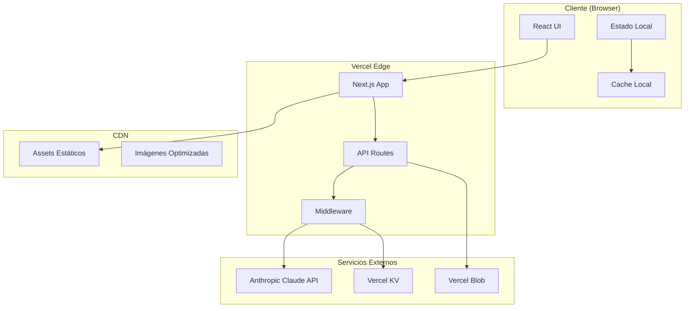
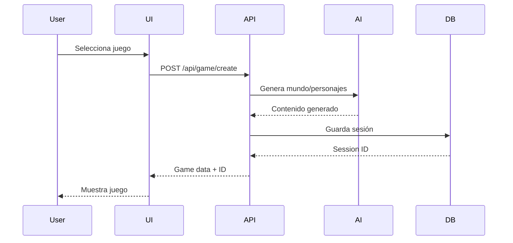
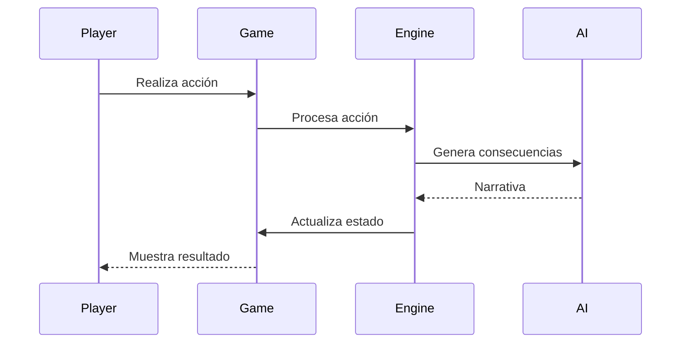

# 🏗️ Arquitectura del Sistema - RpgAInfinity

## 📐 Visión General

RpgAInfinity está construido con una arquitectura modular basada en microservicios frontend, permitiendo escalabilidad, mantenibilidad y desarrollo independiente de cada módulo de juego.

## 🎯 Principios de Diseño

1. **Modularidad**: Cada juego es un módulo independiente
2. **Reutilización**: Componentes compartidos entre módulos
3. **Escalabilidad**: Arquitectura serverless con Vercel
4. **Performance**: SSR/ISR con Next.js para carga rápida
5. **Seguridad**: API keys en servidor, validación estricta

## 🏛️ Arquitectura de Alto Nivel



## 📦 Estructura del Proyecto

```
RpgAInfinity/
├── src/
│   ├── app/                    # Next.js App Router
│   │   ├── layout.tsx          # Layout principal
│   │   ├── page.tsx            # Landing page
│   │   ├── games/              # Rutas de juegos
│   │   │   ├── rpg/           # RPG Cooperativo
│   │   │   ├── deduction/     # Deducción Social
│   │   │   └── village/       # Simulador Villa
│   │   └── api/                # API Routes
│   │       ├── ai/            # Endpoints IA
│   │       └── game/          # Lógica de juego
│   │
│   ├── components/             # Componentes React
│   │   ├── shared/            # Componentes compartidos
│   │   ├── game/              # Componentes de juego
│   │   └── ui/                # Componentes UI base
│   │
│   ├── lib/                    # Librerías y utilidades
│   │   ├── ai/                # Integración Claude
│   │   ├── game-engine/       # Motor de juego
│   │   ├── database/          # Acceso a datos
│   │   └── utils/             # Utilidades
│   │
│   ├── hooks/                  # Custom React Hooks
│   ├── types/                  # TypeScript types
│   └── styles/                 # Estilos globales
│
├── public/                     # Assets públicos
├── tests/                      # Tests
├── docs/                       # Documentación
└── config/                     # Configuración
```

## 🔧 Stack Técnico Detallado

### Frontend
```typescript
// Next.js 14 con App Router
// React 18 con Server Components
// TypeScript 5.x para type safety

// Ejemplo de Server Component
export default async function GamePage() {
  const gameData = await fetchGameData(); // Server-side
  return <GameClient initialData={gameData} />;
}
```

### Gestión de Estado
```typescript
// Zustand para estado global
// React Query para server state
// Local Storage para persistencia

interface GameStore {
  players: Player[];
  currentGame: Game | null;
  settings: GameSettings;
  actions: {
    addPlayer: (player: Player) => void;
    startGame: (config: GameConfig) => void;
  };
}
```

### Integración IA
```typescript
// Servicio de IA con rate limiting y caching
class AIService {
  private client: AnthropicClient;
  private cache: Map<string, AIResponse>;
  
  async generateContent(prompt: string): Promise<AIResponse> {
    // Check cache first
    if (this.cache.has(prompt)) {
      return this.cache.get(prompt);
    }
    
    // Rate limiting
    await this.rateLimiter.check();
    
    // Call Claude API
    const response = await this.client.messages.create({
      model: "claude-3-opus-20240229",
      max_tokens: 1000,
      messages: [{ role: "user", content: prompt }]
    });
    
    // Cache response
    this.cache.set(prompt, response);
    return response;
  }
}
```

### Base de Datos
```typescript
// Vercel KV para sesiones y estado
// Vercel Blob para assets generados

// Esquema de datos
interface GameSession {
  id: string;
  gameType: GameType;
  players: Player[];
  state: GameState;
  history: Event[];
  createdAt: Date;
  updatedAt: Date;
}

interface Player {
  id: string;
  name: string;
  avatar?: string;
  stats: PlayerStats;
  achievements: Achievement[];
}
```

## 🔄 Flujo de Datos

### 1. Inicialización del Juego


### 2. Turno de Juego


## 🚀 Optimizaciones de Performance

### 1. Server-Side Rendering (SSR)
- Páginas estáticas pre-renderizadas
- Datos iniciales en servidor
- Hidratación selectiva

### 2. Code Splitting
```javascript
// Lazy loading de módulos de juego
const RPGGame = lazy(() => import('./games/RPG'));
const DeductionGame = lazy(() => import('./games/Deduction'));
```

### 3. Caching Strategy
- **CDN**: Assets estáticos (1 año)
- **Browser**: API responses (5 min)
- **Server**: AI responses (1 hora)
- **KV Store**: Game state (24 horas)

### 4. Image Optimization
```jsx
// Next.js Image con lazy loading
<Image 
  src="/hero.webp"
  alt="Hero"
  width={800}
  height={600}
  priority={false}
  placeholder="blur"
/>
```

## 🔒 Seguridad

### 1. API Protection
```typescript
// Middleware de autenticación
export async function middleware(request: NextRequest) {
  const token = request.headers.get('authorization');
  
  if (!token || !isValidToken(token)) {
    return new Response('Unauthorized', { status: 401 });
  }
  
  // Rate limiting
  const identifier = request.ip || 'anonymous';
  const { success } = await ratelimit.limit(identifier);
  
  if (!success) {
    return new Response('Too Many Requests', { status: 429 });
  }
  
  return NextResponse.next();
}
```

### 2. Environment Variables
```env
# .env.local (never committed)
ANTHROPIC_API_KEY=sk-ant-...
KV_URL=redis://...
KV_REST_API_URL=https://...
KV_REST_API_TOKEN=...
BLOB_READ_WRITE_TOKEN=...
```

### 3. Input Validation
```typescript
// Zod para validación de esquemas
const GameConfigSchema = z.object({
  players: z.array(z.string()).min(1).max(8),
  difficulty: z.enum(['easy', 'normal', 'hard']),
  theme: z.string(),
  duration: z.number().min(5).max(60)
});
```

## 📊 Monitoreo y Analytics

### 1. Vercel Analytics
- Performance metrics
- Web Vitals
- User engagement

### 2. Error Tracking
```typescript
// Sentry para error tracking
Sentry.init({
  dsn: process.env.SENTRY_DSN,
  environment: process.env.NODE_ENV,
  tracesSampleRate: 0.1
});
```

### 3. Custom Metrics
```typescript
// Métricas de juego
interface GameMetrics {
  gamesStarted: number;
  gamesCompleted: number;
  averageSessionTime: number;
  playerRetention: number;
  aiTokensUsed: number;
}
```

## 🔄 CI/CD Pipeline

### GitHub Actions
```yaml
name: Deploy to Vercel
on:
  push:
    branches: [main]
  pull_request:
    branches: [main]

jobs:
  test:
    runs-on: ubuntu-latest
    steps:
      - uses: actions/checkout@v3
      - uses: actions/setup-node@v3
      - run: npm ci
      - run: npm test
      - run: npm run lint
      
  deploy:
    needs: test
    runs-on: ubuntu-latest
    steps:
      - uses: actions/checkout@v3
      - uses: vercel/action@v3
        with:
          vercel-token: ${{ secrets.VERCEL_TOKEN }}
```

## 🎮 Módulos del Sistema

### 1. Motor de Generación Narrativa
- Prompts optimizados para Claude
- Templates de historias
- Sistema de memoria contextual

### 2. Sistema de Decisiones
- Árbol de decisiones dinámico
- Consecuencias ponderadas
- Múltiples finales

### 3. Gestión de Personajes
- Generación procedural
- Rasgos de personalidad
- Evolución dinámica

### 4. Sistema de Recursos
- Economía del juego
- Balance automático
- Progresión adaptativa

## 📈 Escalabilidad

### Horizontal Scaling
- Serverless functions auto-escalables
- CDN global de Vercel
- Edge functions para baja latencia

### Vertical Scaling
- Optimización de prompts AI
- Caching agresivo
- Batch processing

## 🔮 Consideraciones Futuras

1. **WebSockets**: Para multijugador en tiempo real
2. **PWA**: Funcionamiento offline
3. **i18n**: Soporte multiidioma
4. **Blockchain**: NFTs para personajes únicos
5. **AR/VR**: Experiencias inmersivas

---

*Última actualización: Enero 2025*