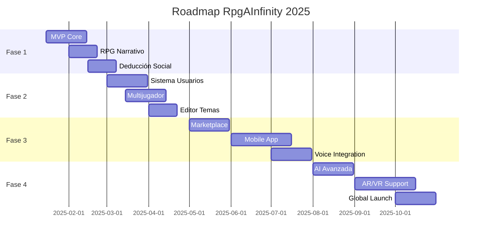
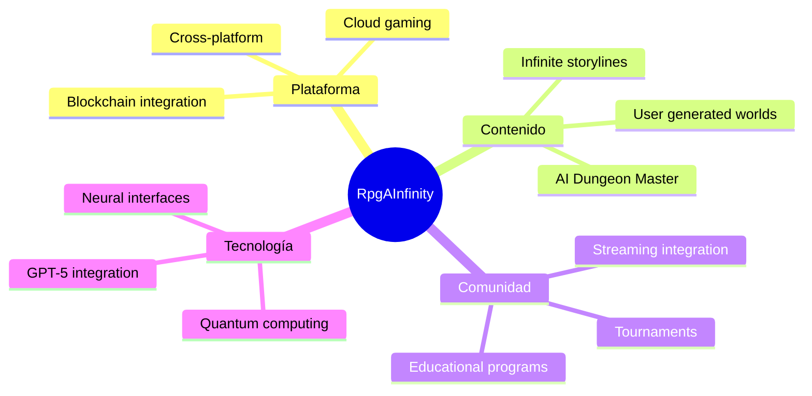

# 🗺️ Roadmap Detallado - RpgAInfinity

## 📌 Visión del Producto

Crear el ecosistema definitivo de juegos narrativos generativos que transformen cada sesión familiar en una experiencia única e inolvidable, potenciada por IA de última generación.

## 🎯 Objetivos Estratégicos

1. **Innovación**: Ser pioneros en juegos narrativos con IA generativa
2. **Accesibilidad**: Experiencias adaptables para todas las edades
3. **Escalabilidad**: Arquitectura serverless infinitamente escalable
4. **Comunidad**: Crear un ecosistema colaborativo de creadores

## 📅 Timeline General



## 🚀 Fase 1: Fundación (Q1 2025)

### Completado

- [ ] Prototipo funcional de los 3 juegos base
- [ ] Integración básica con Claude API
- [ ] Componentes React reutilizables
- [ ] Sistema de generación procedural

### 🔄 En Progreso (Enero 2025)

#### 1.1 Infraestructura Base

```typescript
// Estructura de proyecto
- [ ] Setup Next.js 14 con App Router
- [ ] Configuración TypeScript estricta
- [ ] Sistema de diseño con Tailwind
- [ ] Integración Vercel (CI/CD)
- [ ] Testing suite (Jest + Playwright)
```

#### 1.2 Motor de Juego Core

```typescript
interface GameEngine {
  - [ ] Sistema de estados
  - [ ] Gestor de eventos
  - [ ] Motor de reglas
  - [ ] Sistema de persistencia
  - [ ] Analytics integrado
}
```

#### 1.3 Integración IA

- [ ] Servicio de Claude optimizado
- [ ] Sistema de prompts dinámicos
- [ ] Caché inteligente de respuestas
- [ ] Rate limiting y error handling
- [ ] Fallback para offline

### 📋 Febrero 2025

#### 1.4 RPG Cooperativo Narrativo

**Features:**

- [ ] Generador de mundos únicos
- [ ] Sistema de personajes con IA
- [ ] Árbol de decisiones dinámico
- [ ] Combate táctico simplificado
- [ ] Sistema de inventario
- [ ] Misiones procedurales

**Tech Tasks:**

```javascript
// Componentes necesarios
- [ ] WorldGenerator.tsx
- [ ] CharacterCreator.tsx
- [ ] NarrativeEngine.tsx
- [ ] CombatSystem.tsx
- [ ] InventoryManager.tsx
- [ ] QuestTracker.tsx
```

#### 1.5 Motor de Deducción Social

**Features:**

- [ ] 10+ temas de juego
- [ ] Generación de roles dinámicos
- [ ] Sistema de votación
- [ ] Pistas contextuales
- [ ] Múltiples modos de juego

**Implementación:**

```typescript
class DeductionGame {
  themes: Theme[];
  generateRoles(players: number): Role[];
  createNarrative(theme: Theme): Story;
  processVoting(votes: Vote[]): Result;
  revealTraitor(): Revelation;
}
```

### 📊 Métricas Fase 1

- **Performance**: < 3s tiempo de carga
- **Engagement**: 20+ min por sesión
- **Retención**: 60% juegan 2+ veces
- **Bugs críticos**: 0
- **Test coverage**: > 80%

## 🌟 Fase 2: Expansión (Q2 2025)

### 🔐 Sistema de Usuarios (Marzo)

#### 2.1 Autenticación

```typescript
// Auth con NextAuth.js
- [ ] Login social (Google, Discord)
- [ ] Magic links email
- [ ] Perfiles de usuario
- [ ] Roles y permisos
- [ ] 2FA opcional
```

#### 2.2 Perfiles Familiares

- [ ] Crear grupos familiares
- [ ] Perfiles para niños (COPPA compliant)
- [ ] Control parental
- [ ] Compartir entre familias
- [ ] Estadísticas familiares

#### 2.3 Persistencia Cloud

```typescript
interface CloudSave {
  - [ ] Guardado automático
  - [ ] Sincronización multi-dispositivo
  - [ ] Historial de partidas
  - [ ] Replay de juegos
  - [ ] Export/Import data
}
```

### 🌐 Multijugador Online (Marzo-Abril)

#### 2.4 Infraestructura Realtime

- [ ] WebSockets con Socket.io
- [ ] Salas de juego
- [ ] Matchmaking
- [ ] Voice chat opcional
- [ ] Sistema de amigos

#### 2.5 Modos Multijugador

```javascript
modes: {
  cooperative: "Familia vs IA",
  competitive: "Familia vs Familia",
  asymmetric: "1 vs Todos",
  tournament: "Eliminatorias",
  persistent: "Mundo persistente"
}
```

### 🎨 Editor de Temas (Abril)

#### 2.6 Creador Visual

- [ ] Drag & drop interface
- [ ] Templates predefinidos
- [ ] Asset library
- [ ] Preview en tiempo real
- [ ] Validación automática

#### 2.7 Compartir Creaciones

```typescript
interface ThemeMarketplace {
  upload(theme: CustomTheme): void;
  browse(filters: Filter[]): Theme[];
  rate(themeId: string, rating: number): void;
  download(themeId: string): Theme;
  remix(baseTheme: Theme): CustomTheme;
}
```

### 📈 KPIs Fase 2

- **Usuarios registrados**: 1,000+
- **Temas custom**: 100+
- **Partidas multijugador**: 500+/semana
- **Satisfacción**: 4.5+ estrellas

## 🚀 Fase 3: Ecosistema (Q3 2025)

### 🛍️ Marketplace (Mayo)

#### 3.1 Economía del Juego

```typescript
// Sistema de monetización ético
- [ ] Moneda virtual (gemas)
- [ ] Packs de expansión
- [ ] Temas premium
- [ ] Suscripción opcional
- [ ] Revenue sharing creadores
```

#### 3.2 Content Creator Tools

- [ ] SDK para desarrolladores
- [ ] API pública
- [ ] Documentación interactiva
- [ ] Programa de partners
- [ ] Eventos de la comunidad

### 📱 Aplicación Móvil (Junio-Julio)

#### 3.3 React Native App

```javascript
platforms: {
  iOS: {
    minVersion: "14.0",
    features: ["ARKit", "GameCenter"]
  },
  Android: {
    minVersion: "API 26",
    features: ["ARCore", "PlayGames"]
  }
}
```

#### 3.4 Features Móviles

- [ ] Modo offline completo
- [ ] Push notifications
- [ ] Sincronización cloud
- [ ] Controles táctiles optimizados
- [ ] Modo ahorro batería

### 🎙️ Integración de Voz (Julio)

#### 3.5 Asistentes de Voz

- [ ] Alexa Skills
- [ ] Google Assistant Actions
- [ ] Narración con TTS
- [ ] Comandos de voz
- [ ] Accesibilidad mejorada

### 🎯 Objetivos Fase 3

- **Downloads app**: 10,000+
- **Ingresos mensuales**: $5,000+
- **Creadores activos**: 50+
- **Retención 30 días**: 40%

## 🌌 Fase 4: Innovación (Q4 2025)

### 🤖 IA Avanzada (Agosto)

#### 4.1 Personalización Profunda

```python
# ML Pipeline
- [ ] Análisis de preferencias
- [ ] Generación adaptativa
- [ ] Dificultad dinámica
- [ ] Narrativas personalizadas
- [ ] Predicción de engagement
```

#### 4.2 NPCs Autónomos

- [ ] Memoria persistente
- [ ] Personalidades evolutivas
- [ ] Relaciones complejas
- [ ] Diálogos contextuales
- [ ] Emociones simuladas

### 🥽 AR/VR Support (Septiembre)

#### 4.3 Realidad Aumentada

```typescript
ARFeatures: {
  - [ ] Tablero AR
  - [ ] Personajes 3D
  - [ ] Gestos manuales
  - [ ] Multiplayer AR
  - [ ] Portal mode
}
```

#### 4.4 Realidad Virtual

- [ ] Quest 3 support
- [ ] Ambientes inmersivos
- [ ] Controles VR
- [ ] Social VR spaces
- [ ] Comfort options

### 🌍 Lanzamiento Global (Octubre)

#### 4.5 Localización

```javascript
languages: ['es', 'en', 'fr', 'de', 'it', 'pt', 'ja', 'zh'];
```

#### 4.6 Marketing Campaign

- [ ] Product Hunt launch
- [ ] Press kit
- [ ] Influencer partnerships
- [ ] Game conferences
- [ ] Awards submissions

### 🎊 Métricas de Éxito Fase 4

- **Usuarios activos**: 50,000+
- **Países**: 30+
- **NPS Score**: 70+
- **Tiempo en VR**: 30+ min/sesión

## 🔮 Futuro (2026+)

### Visión a Largo Plazo



### Expansiones Potenciales

1. **RpgAInfinity Education**: Versión educativa para escuelas
2. **Corporate Training**: Módulos de team building
3. **Therapeutic Games**: Colaboración con terapeutas
4. **E-Sports League**: Competencias profesionales
5. **Netflix Integration**: Serie interactiva

## 📊 Métricas de Éxito Global

### KPIs Principales

| Métrica         | Q1 2025 | Q2 2025 | Q3 2025 | Q4 2025 |
| --------------- | ------- | ------- | ------- | ------- |
| MAU             | 1K      | 10K     | 50K     | 100K    |
| DAU             | 100     | 2K      | 15K     | 35K     |
| Sesiones/día    | 200     | 5K      | 40K     | 100K    |
| Tiempo promedio | 20min   | 25min   | 30min   | 35min   |
| Retención D30   | 30%     | 35%     | 40%     | 45%     |
| Revenue         | $0      | $1K     | $5K     | $15K    |

### Tech Metrics

- **Uptime**: 99.9%
- **Response time**: < 200ms
- **Error rate**: < 0.1%
- **Test coverage**: > 90%
- **Lighthouse score**: > 95

## 🤝 Colaboraciones Estratégicas

### Partners Potenciales

- **Anthropic**: Partner oficial de IA
- **Vercel**: Sponsor de infraestructura
- **Discord**: Integración social
- **Steam**: Distribución PC
- **Netflix**: Contenido interactivo

### Programa de Embajadores

- Creadores de contenido
- Educadores
- Terapeutas familiares
- Game designers
- Streamers

## 💡 Innovaciones Técnicas

### Research & Development

```typescript
// Áreas de investigación activa
research: {
  "Narrative AI": "Historias que se escriben solas",
  "Emotion Recognition": "Adaptar según estado emocional",
  "Procedural Music": "Banda sonora generativa",
  "AI Directors": "Experiencias cinematográficas",
  "Quantum Narratives": "Historias cuánticas paralelas"
}
```

## 📝 Notas Finales

Este roadmap es un documento vivo que se actualizará mensualmente basado en:

- Feedback de usuarios
- Avances tecnológicos
- Oportunidades de mercado
- Recursos disponibles
- Prioridades estratégicas

### Principios Guía

1. **Usuario primero**: Cada decisión beneficia al jugador
2. **Innovación constante**: Siempre explorando nuevas ideas
3. **Calidad sobre cantidad**: Mejor pocas features excelentes
4. **Comunidad activa**: Los usuarios dan forma al producto
5. **Diversión garantizada**: Si no es divertido, no lo lanzamos

---

_Última actualización: Enero 2025_
_Próxima revisión: Febrero 2025_
